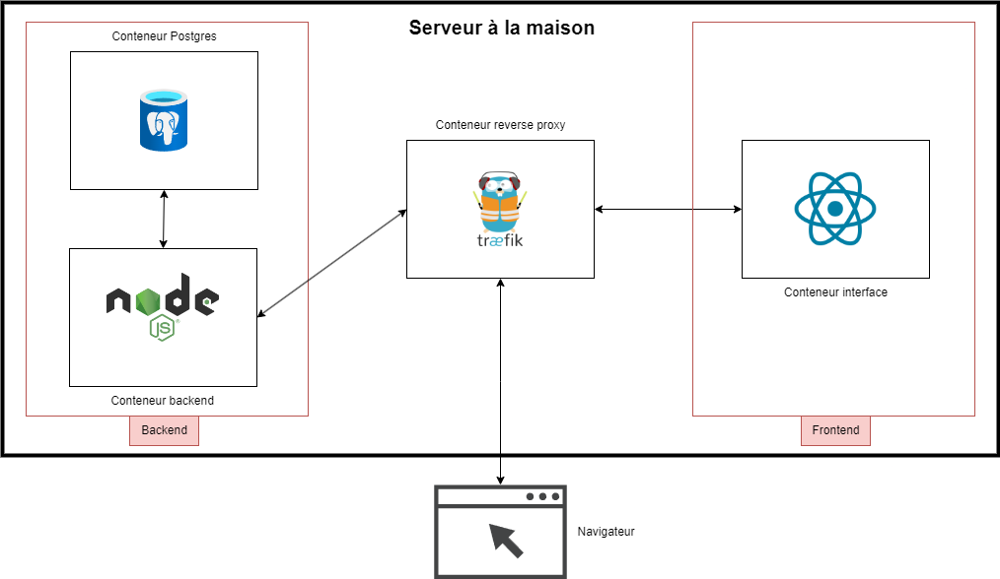

# Gestion-Decheterie-Infra

## Rapport

## Table des matières

1. Description du projet
1.1. Objectifs
1.2. Exigences fonctionnelles
1.2.1. Besoins fonctionnels - Données
1.2.2. Besoins fonctionnels - Roles
1.2.3. Besoins fonctionnels - Connexion
1.2.4. Exigences non-fonctionnelles

2. Description préliminaire de l’architecture
2.1. Backend
2.2. Frontend
2.3. Base de données
2.4. Reverse proxy
2.5. Environnement de deploiment

3. Mockups / Landing page

4. Description des choix techniques
4.1. Backend
4.2. Frontend
4.3. Base de données
4.4. Reverse proxy
4.5. Environnement de deploiment

5. Description du processus de travail
5.1. Travail en pair programming
5.2. Tests avant le code (Test-First Programming)
5.3. Répartition des tâches
5.4. Structuration de notre travail
5.4.1. Intégration continue et gestion des branches
5.4.2. Pipeline
5.4.3. Tests
5.4.4. Schéma workflow

### 1. Description du projet

#### 1.1. Objectifs

L'objectif de ce projet est de créer un système de base de données dédié à la gestion des déchèteries de Suisse.

Le but principal est de fournir un outil qui simplifiera la gestion des déchèteries nationales. Cette base de données permettra un suivi précis des informations essentielles.

Le projet vise à accroître l'efficacité opérationnelle des déchèteries en offrant un système centralisé pour la gestion du personnel, des équipements, et des flux de déchets. Il contribuera ainsi à une meilleure organisation des activités de collecte et de gestion des déchets, tout en facilitant la traçabilité.

#### 1.2. Exigences fonctionnelles

##### 1.2.1. Besoins fonctionnels - Données

Chaque déchèterie possède des contenants, des employés, une adresse et des ramassages qui ont été/seront effectués dans celle-ci.

- Un employé possède un nom, prénom, une date de naissance, un numéro de téléphone, une adresse, date de début contrat, une fonction, un supérieur et un type de permis (B, C) (pas obligatoirement). Chaque employé est affecté à une déchèterie et possède un login pour se connecter à l’application.
- Une adresse est décrite par une rue et numéro, un code postal, une ville et un pays
- Il y a comme fonction : Responsable, Secrétaire, Chauffeur, Employé.

Une déchèterie principale en plus d’avoir les mêmes attributs qu’une déchèterie possède des moyens de transport des déchets (véhicules).

Les contenants sont soit des bennes, des palettes, des grandes caisses ou des big bag et possède un type de déchets contenu.

- Les bennes, les grandes caisses, les big bag et les palettes on une couleur et une capactié maximale (en litre).
- Les big bag ont une taille : petite, moyenne ou grande.
- Les palettes possèdent un nombre de cadres (entre 0 et 4).

Les moyens de transport sont soit des camions, soit des camionnettes et possèdent un numéro d’immatriculation, année de fabrication, date de la dernière expertise, une consommation de carburant ainsi qu'une indication avec ou sans remorque. Les camions et la camionette peuvent transporter tous types de contenants.

Les différents types de déchets possibles sont :

- Papier
- Carton
- Flaconnage
- Encombrants
- Déchets verts
- Inertes
- Ferraille
- Pet
- Alu
- Fer blanc
- Verre
- Bois
- Appareils électroniques
- Appareils électriques
- Déchets spéciaux

Chaque type de déchets est associé à un contenant en fonction de la manière dont il est stocké sur place.

##### 1.2.2. Besoins fonctionnels - Roles

| Rôle            | Tables           | Lecture                            | Ajout                               | Modification                       | Suppression                        |
|-----------------|------------------|------------------------------------|-------------------------------------|------------------------------------|------------------------------------|
| **Employé + Chauffeur** | Ramassages       | ✅ Présents et futurs      | ✅                                 | ❌                                 | ❌                                 |
|                 | Employé          | ✅ Ses propres infos               | ❌                                 | ❌                                 | ❌                                 |
|                 | Véhicules        | ✅                                 | ❌                                 | ❌                                 | ❌                                 |
|                 | Contenants       | ✅                                 | ❌                                 | ❌                                 | ❌                                 |
|                 | Déchèterie       | ✅                                 | ❌                                 | ❌                                 | ❌                                 |
|                 | Adresse          | ✅                                 | ✅                                 | ✅                                 | ✅                                 |
|                 | Status           | ✅                                 | ❌                                 | ❌                                 | ❌                                 |
|                 | Fonctions        | ✅                                 | ❌                                 | ❌                                 | ❌                                 |
|                 | Déchets          | ✅                                 | ❌                                 | ❌                                 | ❌                                 |
| **Secrétaire**  | Ramassages       | ✅                                 | ✅                                 | ✅                                 | ✅                                 |
|                 | Employé          | ✅ Ses propres infos               | ❌                                 | ❌                                 | ❌                                 |
|                 | Véhicules        | ✅                                 | ✅                                 | ✅                                 | ✅                                 |
|                 | Contenants       | ✅                                 | ✅                                 | ✅                                 | ✅                                 |
|                 | Déchèterie       | ✅                                 | ❌                                 | ❌                                 | ❌                                 |
|                 | Adresse          | ✅                                 | ✅                                 | ✅                                 | ✅                                 |
|                 | Status           | ✅                                 | ❌                                 | ❌                                 | ❌                                 |
|                 | Fonctions        | ✅                                 | ❌                                 | ❌                                 | ❌                                 |
|                 | Déchets          | ✅                                 | ❌                                 | ❌                                 | ❌                                 |
| **Responsable** | Ramassages       | ✅                                 | ✅                                 | ✅                                 | ✅                                 |
|                 | Employés         | ✅                                 | ✅                                 | ✅                                 | ✅                                 |
|                 | Véhicules        | ✅                                 | ✅                                 | ✅                                 | ✅                                 |
|                 | Contenants       | ✅                                 | ✅                                 | ✅                                 | ✅                                 |
|                 | Déchèterie       | ✅                                 | ✅                                 | ✅                                 | ✅                                 |
|                 | Adresse          | ✅                                 | ✅                                 | ✅                                 | ✅                                 |
|                 | Status           | ✅                                 | ❌                                 | ❌                                 | ❌                                 |
|                 | Fonctions        | ✅                                 | ❌                                 | ❌                                 | ❌                                 |
|                 | Déchets          | ✅                                 | ❌                                 | ❌                                 | ❌                                 |

- Un secrétaire, un chauffeur ou un responsable ne peut que travailler pour une déchèterie principale.
- Toutes les informations doivent être uniquement disponible pour les employé de la même déchèterie principale. Par exemple il est impossible de voir les ramassage d'une autre déchèterie principale.

##### 1.2.3. Besoins fonctionnels - Connexion

- Une page de connexion permet à l'utilisateur de se connecter avec un nom d'utilisateur et un mot de passe.
- Un employé peut modifier son mot de passe.

##### 1.2.4. Exigences non-fonctionnelles

- Un employé sans connaissance en informatique doit pouvoir prendre en main l’application en moins de 20 minutes avec l'aide d'une formation ou d'un mode d'emploi.
- Le système sera disponible 24 heures sur 24, avec un taux d'indisponibilité n'exédant pas 5 minutes par jour.
- Le système doit pouvoir gérer 1000 requêtes par seconde avec 90% du temps de réponse inférieure à 500ms.
- Le système doit pouvoir démarrer après une panne en moins de 5 minutes.
- L'application complète sans l'application Docker doit faire moins de 5 Go.
- Les clients doivent pouvoir utiliser l'application via n'importe quel navigateur web moderne depuis un ordinateur.
- Il doit être possible d'utiliser l'application depuis un navigateur de téléphone.
- Les mots de passe sont stockés dans la base de donnée sous forme de hash.
- La page web doit utiliser une version sûre du protocole https pour garantir la confidentialité et l'authenticité des données.
- Une protection contre le brute force est mise en place ainsi que contre les principales vulnérabilités connues (injection sql, timing attack, message d'erreur trop explicite, etc.).

### 2. Description préliminaire de l’architecture

Notre architecture est composée de 4 conteneurs **Docker**, le tout orchestré par un **Docker compose**.

#### 2.1. Backend

Le backend est une API REST écrite en **Node.js**, c'est avec celui-ci que communiqueront la base de données et le frontend.

#### 2.2. Frontend

Le frontend est une application **React**, c'est l'interface que les utilisateurs finaux utiliseront avec un navigateur web.

#### 2.3. Base de données

La base de données est une base de données **PostgreSQL** avec un script d'initialisation écrit en **SQL**.

#### 2.4. Reverse proxy

Le reverse proxy utilise **Traefik** et permet au backend et au frontend d'être accessibles via le même port tout en répartissant les différentes requêtes au bon conteneur.

#### 2.5. Environnement de deploiment

Nous utiliserons un PC x86 fixe comme serveur que nous ferons tourner à la maison. Ce serveur nous permettra de déployer notre application et faire tourner notre infrastructure. Le serveur utilisera comme OS **ubuntu server** avec docker installé.

### 3. Mockups / Landing page

**Écran de connexion :** L'utilisateur démarre en saisissant son nom d'utilisateur et son mot de passe sur une page de connexion sécurisée pour accéder au système.

**Accueil après connexion :** Une fois connecté, l'utilisateur arrive sur la page d'accueil du logiciel. Cette page présente différentes options de navigation, telles que "Employés", "Ramassage", "Véhicules", et "Déchetèries", chacune représentée par un bouton distinct. A savoir que ceci n'est qu'un exemple. Les boutons pourront varier selon la personne connecté (ou tout simplement être remplacés par autre chose).

**Itinéraire :**  Cette page est dédiée aux chauffeurs et leur permet de visualiser l'itinéraire de leurs ramassages pour la journée. La carte affiche les trajets planifiés, facilitant ainsi la navigation pour les chauffeurs.

**Sélection de "Ramassage" :** L'utilisateur sélectionne l'option "Ramassage" pour accéder à la gestion des ramassages. Cela les redirige vers une page qui lui permet de voir la liste de ramassages concernant ses déchèteries.

**Détail d'un Ramassage :** En cliquant sur un ramassage spécifique dans la liste, l'utilisateur est dirigé vers une page de détails. Cette page affiche des informations complètes sur le ramassage sélectionné, y compris l'itinéraire sur une carte, l'état actuel du ramassage, et d'autres informations critiques.

**Modification/Suppression :** L'utilisateur a également la possibilité de modifier les détails du ramassage ou de le supprimer.

**Ajout de Ramassage :** L'utilisateur peut remplir un formulaire pour ajouter un nouveau ramassage, en renseignant toutes les informations nécessaires telles que l'ID, la date, le véhicule utilisé, etc. avant de sauvegarder ces informations.

**Autres Modules :** Bien que ce mockup se concentre sur la fonctionnalité "Ramassage", les autres modules comme "Employés", "Véhicules", "Déchetèries", "Contenants", etc. suivent une logique similaire.
L'utilisateur peut accéder à ces sections depuis le menu, visualiser des listes d'éléments (employés, véhicules, etc.), consulter des détails spécifiques, ajouter de nouveaux éléments, et modifier ou supprimer les existants.

Nous avons également créer une [Landing page](https://pdg-gr9-gestion-decheterie.github.io/) que vous pouvez aller consulter à l'url suivante : https://pdg-gr9-gestion-decheterie.github.io

### 4. Description des choix techniques

#### 4.1. Backend

Nous avons choisi **Node.js** pour son efficacité à gérer plusieurs clients simultanément sur un même thread, grâce à son architecture non bloquante et basée sur des événements. Cette approche permet de garder de bonnes performances, notamment pour dans le cadre d'API où un grand nombre de requêtes concurrentes sont effectuées.

Pour structurer notre application, nous utiliserons **Express.js**. Express.js simplifie la gestion des routes, des middlewares et des requêtes HTTP, permettant de créer des API RESTful de manière efficace et flexible. De plus il y a un grand nombre de plugins disponibles pour toutes sortes de fonctionnalités.

Nous utiliserons **Passport** pour gérer les cookies pour l'authentification des utilisateurs. Lié à bCrypt, cela permet d'avoir une authentificaiton sûre avec un stockage des mots de passe sécurisé dans la base de données.

#### 4.2. Frontend

Nous avons choisi **React** pour sa popularité lorsqu'il s'agit de développer des interfaces web modernes et pour que les utilisateurs puissent bénéficier d'une expérience fluide. Nous avons également choisi d'utiliser **MUI** afin de disposer de composants préfabriqués et d'une interface intuitive.

#### 4.3. Base de données

Nous avons choisi **PostgreSQL** parce que c'est un SGBD open source reconnu pour sa fiabilité et qu'il est idéal pour les applications nécessitant un haut niveau de performance.

#### 4.4. Reverse proxy

Nous avons choisi d'implémenter un reverse proxy afin de communiquer en http avec le serveur backend et le serveur frontend et de gérer la connexion ssl en un seul point. De plus, il permet de faire du load balancing avec sticky session et de rediriger certaines url sur un conteneur spécifique (/api).
Il permet également de gérer plusieurs nom de domaine différents sur la même adresse IP publique.

#### 4.5. Environnement de deploiment

Nous avons choisi la solution d'héberger notre propre infrastrucure car cette solution est gratuite, garanti la sécurité des données et nous permet de vendre notre solution clé en main à héberger directement chez le client. De cette manière nous pouvons mettre en avant la sécurité et la confidentialité des données avec notre solution.

### 5. Description du processus de travail

Nous avons opté pour la méthode Extreme Programming (XP) afin de développer notre application, après avoir comparé diverses méthodes Agiles. Cette décision s'appuie sur les avantages spécifiques de XP, qui incluent :

Des cycles de développement courts : Ils nous permettent de réagir rapidement aux besoins changeants et d'améliorer continuellement l'application.
Des tests automatisés : Ces tests garantissent la fiabilité du code, réduisent les erreurs et accélèrent les cycles de développement.
Une planification progressive et flexible : Cette approche nous donne la possibilité d'adapter facilement nos priorités selon l'évolution du projet.

Nous avons décidé de mettre en place les pratiques suivantes pour nous aider dans le développement :

#### 5.1. Travail en pair programming

Nous avons formé deux groupes de deux personnes, chacun travaillant en programmation en paire. Cela nous permet de répartir efficacement les tâches tout en ayant une responsabilité partagée entre 2 personnes.
Chaque groupe se concentre sur un aspect spécifiques du projet.

Régulièrement, nous organisons de "petites réunions" pour synchroniser nos avancées et discuter des potentiels problèmes rencontrés et/ou des questions à adresser aux assistants.
Cela favorise une communication ouverte et permet un retour d'information continu.

#### 5.2. Tests avant le code (Test-First Programming)

Nous appliquons le principe du **Test-First Programming**, qui consiste à écrire des tests avant de commencer l'implémentation des fonctionnalités afin de garantir que chaque fonctionnalité est validée et fonctionne comme pérvu avant d'être intégrée dans le projet.

#### 5.3. Répartition des tâches

Après avoir imaginé notre projet et de toutes les fonctionnalités que nous souhaitons implémenter, une équipe s'est attardée sur la réalisation des mockups/landing page lorsque l'autre s'est occupé de la création de l'organisation Git ainsi que la mise en place de notre pipeline de développement.
Nous avons ensuite décidé de rester sur une double équipe de deux pour la suite pour la réalisation du backend d'une part et du frontend de l'autre.
Chaque équipe est responsable de son domaine tout en maintenant une cohérence entre les deux côtés de l'application.
Cependant, il n'est pas impossible qu'une personne bascule et s'occupe du domaine de l'autre groupe et inversement.

#### 5.4. Structuration de notre travail

Comme mentionné au point précèdent, nous avons créer une organisation pour ce projet et nous y avons ajouté plusieurs repos répartis de manière claire :

- Infra
- Backend
- Frontend
- github.io (Landing page)

Cette organisation permet une séparation et une gestion plus facile sur les différents aspects du projet.

##### 5.4.1. Intégration continue et gestion des branches

Tous nos ajouts et modification de code sont effectués sur des branches de développement (**dev**). Une fois que le travail sur une fonctionnalité (ou tâche) est terminé, nous effectuons un "merge request" pour intégrer ces nouveauté dans la branche **main**.
Une autre personne doit ensuite consulter ce merge request et l'approuver afin que ces modification s'applique et que le pipeline s'occupe d'appliquer ces modifications automatiquement.

##### 5.4.2. Pipeline

Le Pipeline constsite en scripts github actions qui monitorent les pushs sur la branche **main** sur le repository du **backend** et **frontend**. Quand une modification est faite sur une de ces branches, une image docker est automatiquement construite et push sur **Docker Hub** pour être accessible à l'environnement de deploiment. Le server de deploiment n'a plus qu'à faire pull les dernières images avec la commande `docker compose pull` et relancer le docker compose.

##### 5.4.3. Tests

Des tests automatiques sont également efféctués sur le repository **backend** à chaque push. Ces tests sont des tests d'intégration avec la base de données pour vérifier que tout fonctionne correctement dans le backend. Ceci permet de garantir une bonne qualité de code.

##### 5.4.4. Schéma workflow

