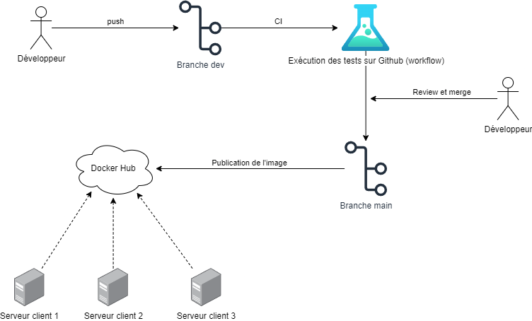

# Pipeline CI/CD : Mode d'Emploi

## Amener une Modification en Production

Ce guide vous explique comment apporter une modification au code et l'amener en production en utilisant notre pipeline CI/CD.

### Étape 1 : Suivre le Workflow de Contribution
Le processus de contribution est le même que celui décrit dans le guide [ContributionProjetWorkflow](ContributionProjetWorkflow.md).

### Étape 2 : Tester le code
Lors de chaque push, les tests d'intégration du backend avec la base de données sont exécutés automatiquement. Assurez-vous que vos modifications passent ces tests avant de créer une *pull request*. Si les tests doivent être mis à jour, vous pouvez les trouver dans le dossier `tests` du backend.

### Étape 4 : Créer une Pull Request
- Accédez à votre dépôt sur GitHub.
- Créez une pull request pour fusionner votre branche ?  `ma-nouvelle-fonctionnalite` dans `main`.
- Demandez à un collègue de réviser votre *pull request*.

### Étape 5 : Revue et Fusion de la Pull Request
Une fois que votre *pull request* est approuvée, elle peut être fusionnée dans la branche `main`. Cette action déclenchera automatiquement le pipeline CI/CD.

### Étape 6 : Exécution Automatique du Pipeline
Le pipeline CI/CD exécutera les actions suivantes automatiquement :

1. **Tests Automatisés** : Les tests d'intégration seront exécutés pour vérifier que tout fonctionne correctement.
2. **Construction de l'Image Docker** : Une nouvelle image Docker sera construite avec les dernières modifications.
3. **Publication sur Docker Hub** : L'image Docker sera publiée sur Docker Hub.

### Étape 7 : Déploiement sur les Serveurs
Les serveurs de production peuvent maintenant récupérer la nouvelle image Docker et redémarrer les services :
    
```bash
docker compose pull
docker compose up -d
```
Votre modification est maintenant en production et disponible pour les utilisateurs.

## Schéma du Pipeline CI/CD

